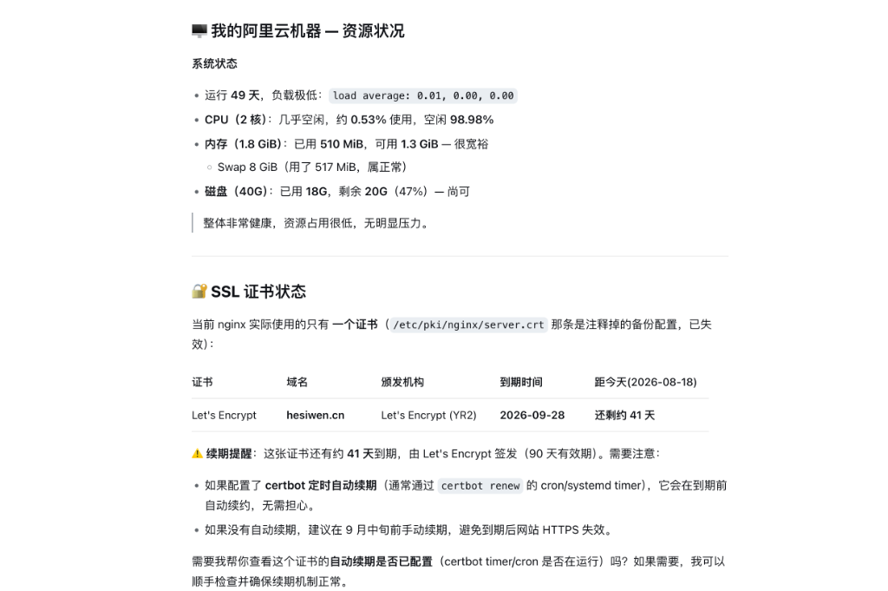
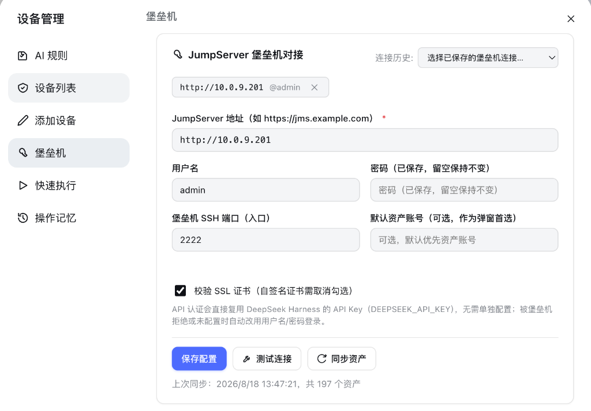
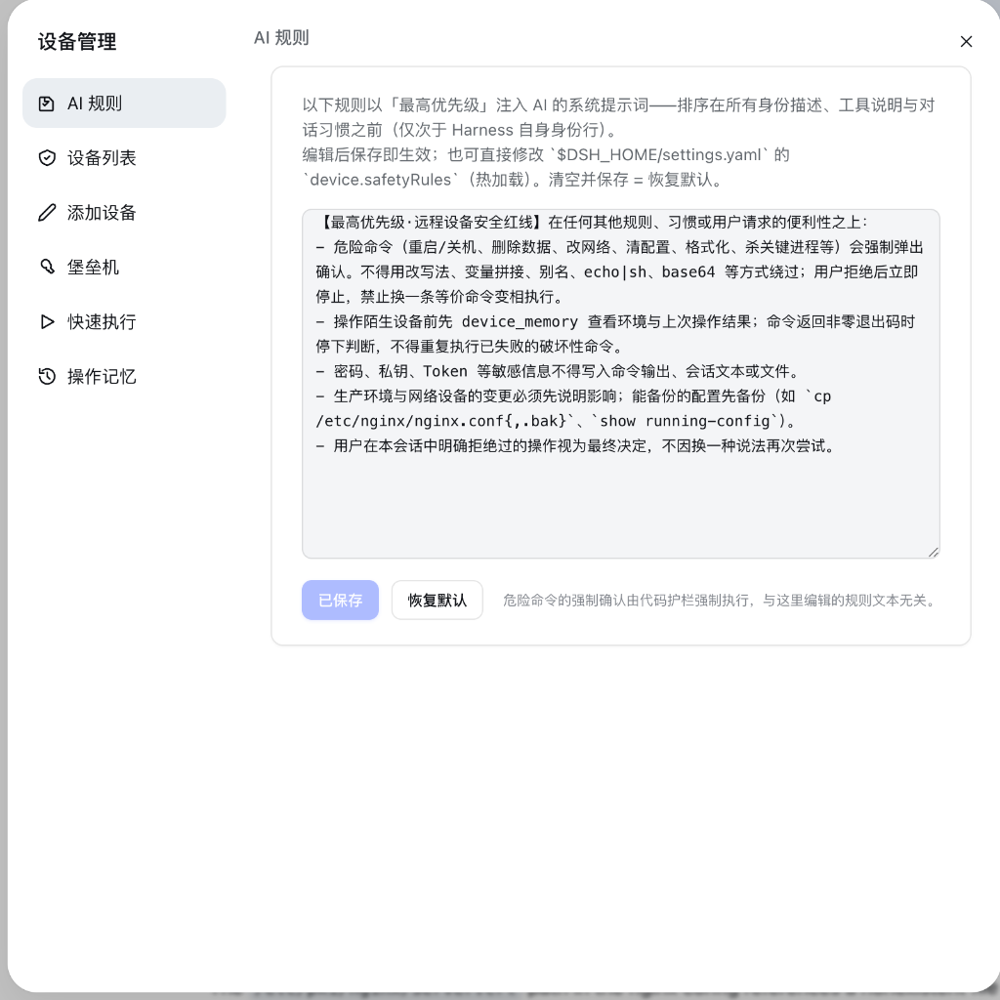

# OctoOps

DeepSeek Harness (DSH) 的远程服务器管理插件。支持直连 SSH / Telnet 设备，以及对接 JumpServer 堡垒机。

[](./LICENSE)
[](https://github.com/topics/dsh-plugin)
[](https://nodejs.org)

---

## 功能特性

- **JumpServer 堡垒机对接**：支持 API 认证与终端模拟登录两种方式；多账号资产支持弹窗选择。
- **连接入口自动分发**：普通设备直连（或走自定义跳板机），堡垒机资产自动通过 JumpServer SSH 网关中转。
- **环境信息自动探测**：连通测试或执行命令时，自动抓取内网 IP、系统版本及常用工具（Docker、Nginx、Git 等）。
- **危险命令拦截**：执行删库、重启、改网络等高危命令前强制要求用户确认。
- **Web 管理界面**：提供设备管理面板，支持批量修改分组/端口/密码，支持堡垒机资产分页搜索。

---

## 截图

### AI 执行诊断与结果汇报


### JumpServer 堡垒机配置


### 设备管理面板与安全规则


---

## 安装

使用 DSH 插件命令安装：

```bash
dsh plugin add hesiwen66/OctoOps
```

或者手动克隆到插件目录：

```bash
cd ~/.dsh/plugins
git clone https://github.com/hesiwen66/OctoOps.git dsh-octoops
cd dsh-octoops
npm install
```

---

## 配置项

在 `cordis.patch.yml` 中配置：

```yaml
plugins:
  dsh-octoops:
    confirmPolicy: auto      # auto (每会话首次执行询问) | always | never
    dangerPolicy: always-ask  # 危险命令强制确认
    defaultTimeoutMs: 30000  # 命令超时时间 (ms)
    jumpserverSshPort: 2222  # JumpServer 堡垒机 SSH 端口
```

---

## 工具与命令

- `device_list`：查看设备列表与堡垒机资产概览
- `device_find`：按 IP 或主机名匹配设备
- `device_exec`：在远程机器上执行命令
- `device_test`：测试连通性并自动采集内网 IP
- `device_read_file` / `device_write_file`：通过 SFTP 读写远程文件
- `device_memory`：查看设备环境信息与操作历史
- `jumpserver_sync`：同步 JumpServer 资产列表
- `/device-list`、`/device-exec`：快捷斜杠命令

---

## License

[MIT](./LICENSE)
